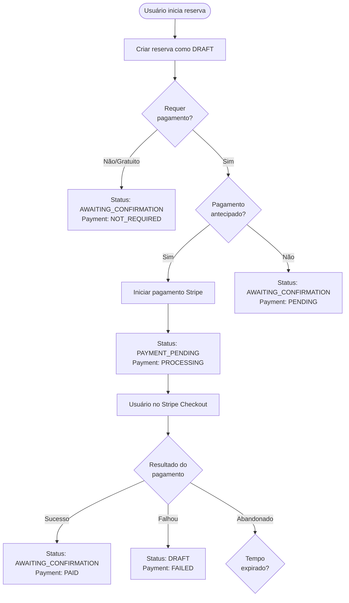

# Guia de Migração: Sistema de Status de Reservas

## Visão Geral

Este documento descreve as mudanças implementadas no sistema de status de reservas para torná-lo mais semântico e informativo sobre o estado real das reservas e pagamentos.

## Principais Mudanças

### 1. Novos Status de Reserva (BOOKING_STATUS)

#### Estados Iniciais
- **DRAFT** - Reserva criada mas pagamento não iniciado
- **PAYMENT_PENDING** - Aguardando conclusão do pagamento (cliente no checkout)
- **AWAITING_CONFIRMATION** - Pagamento concluído ou não necessário, aguardando confirmação do parceiro

#### Estados Ativos
- **CONFIRMED** - Confirmada pelo parceiro
- **IN_PROGRESS** - Em andamento (atividade/serviço sendo executado)

#### Estados Finais
- **COMPLETED** - Concluída com sucesso
- **CANCELED** - Cancelada
- **NO_SHOW** - Cliente não compareceu
- **EXPIRED** - Expirada por falta de pagamento

### 2. Status de Pagamento Aprimorados (PAYMENT_STATUS)

- **NOT_REQUIRED** - Pagamento não necessário (reserva gratuita)
- **PENDING** - Aguardando início do pagamento
- **PROCESSING** - Pagamento sendo processado
- **AWAITING_PAYMENT_METHOD** - Aguardando PIX/Boleto
- **PAID** - Pago com sucesso
- **PARTIALLY_PAID** - Parcialmente pago
- **FAILED** - Falha no pagamento
- **REFUNDED** - Reembolsado
- **PARTIALLY_REFUNDED** - Parcialmente reembolsado
- **CANCELED** - Pagamento cancelado

## Fluxo de Status



## Benefícios para o Admin

### 1. Visualização Clara do Estado
- **Pagamento Pendente**: Reservas em DRAFT ou PAYMENT_PENDING
- **Ação Necessária**: Reservas em AWAITING_CONFIRMATION com pagamento confirmado
- **Problemas**: Reservas EXPIRED, NO_SHOW ou com pagamento FAILED

### 2. Indicadores de Urgência
- **Alta Urgência**: 
  - Pagamento confirmado aguardando confirmação
  - Reservas DRAFT há mais de 15 minutos
- **Média Urgência**: 
  - Cliente no checkout (PAYMENT_PENDING)
- **Baixa Urgência**: 
  - Reservas confirmadas ou concluídas

### 3. Automação de Status
- **Cron Jobs** atualizam automaticamente:
  - Reservas DRAFT → EXPIRED após 30 minutos
  - CONFIRMED → IN_PROGRESS na data/hora da atividade
  - IN_PROGRESS → COMPLETED após o término
  - CONFIRMED → NO_SHOW se não houver check-in

## Implementação

### 1. Mutations Adicionadas

```typescript
// Atualizar quando pagamento é iniciado
updateBookingPaymentInitiated()

// Atualizar após sucesso no pagamento
updateBookingPaymentSuccess()

// Atualizar após falha no pagamento
updateBookingPaymentFailed()

// Expirar reservas abandonadas (cron job)
expireIncompletedBookings()

// Atualizar status baseado em datas (cron job)
updateBookingStatusesByDate()

// Marcar no-shows (cron job)
markNoShowBookings()
```

### 2. Queries Aprimoradas

```typescript
// Buscar reservas por grupo de status
getBookingsByStatusGroup({
  statusGroup: "awaiting_payment" | "awaiting_confirmation" | "active" | "completed" | "problematic" | "all"
})

// Obter estatísticas de status
getBookingStatusStatistics()
```

### 3. Componentes Visuais

- **BookingStatusBadge**: Exibe status com cores e ícones semânticos
- **BookingUrgencyIndicator**: Mostra indicadores de urgência e ações necessárias

## Migração de Dados Existentes

Para reservas existentes com status antigo "pending":

1. Se `paymentStatus === "paid"` → migrar para `AWAITING_CONFIRMATION`
2. Se `paymentStatus === "pending"` e criada há menos de 30 min → migrar para `DRAFT`
3. Se `paymentStatus === "pending"` e criada há mais de 30 min → migrar para `EXPIRED`
4. Se `paymentStatus === "failed"` → manter status mas marcar como `DRAFT`

## Próximos Passos

1. Executar migration script para atualizar reservas existentes
2. Atualizar interfaces de admin para usar novos componentes
3. Configurar notificações baseadas em mudanças de status
4. Treinar equipe sobre novos status e fluxos 