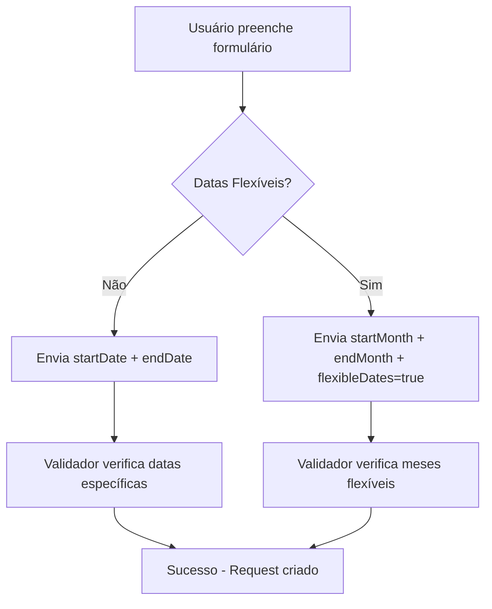

# Correção: Datas Flexíveis e Cidade de Origem

## 🐛 Problemas Identificados

1. **Erro de validação com datas flexíveis**: O sistema enviava `startMonth` e `endMonth` quando `flexibleDates = true`, mas o validador do Convex ainda exigia `startDate` e `endDate` como campos obrigatórios.

2. **Campo de destino incorreto**: O select "Destino Principal" na verdade deveria ser "Cidade de Origem" para indicar de onde o viajante está saindo.

3. **Lista limitada de cidades**: Necessidade de expandir as opções de cidades brasileiras para origem.

## ✅ Soluções Implementadas

### 1. Atualização do Validador Convex

**Arquivo**: `convex/domains/packages/mutations.ts`

- Modificado `tripDetailsValidator` para tornar `startDate` e `endDate` opcionais
- Adicionados campos `startMonth`, `endMonth`, `flexibleDates` e `originCity`
- Atualizada lógica de validação para lidar com ambos os cenários (datas específicas e flexíveis)

```typescript
const tripDetailsValidator = v.object({
  destination: v.string(),
  originCity: v.optional(v.string()),
  // For specific dates
  startDate: v.optional(v.string()),
  endDate: v.optional(v.string()),
  // For flexible dates
  startMonth: v.optional(v.string()),
  endMonth: v.optional(v.string()),
  flexibleDates: v.optional(v.boolean()),
  // ... outros campos
});
```

### 2. Lógica de Validação Inteligente

- **Datas específicas**: Valida que `startDate` e `endDate` existem e são válidas
- **Datas flexíveis**: Valida que `startMonth` e `endMonth` existem e que o mês final não é anterior ao inicial

### 3. Adição do Campo Cidade de Origem

**Arquivo**: `src/app/pacotes/page.tsx`

- Adicionado novo select com 28 cidades brasileiras principais
- Incluído campo `originCity` no estado do formulário
- Campo enviado no `tripDetails` para o Convex

### 4. Lista Abrangente de Cidades Brasileiras

Incluídas todas as capitais brasileiras e principais cidades:
- São Paulo, Rio de Janeiro, Belo Horizonte, Brasília
- Salvador, Fortaleza, Recife, Porto Alegre
- Curitiba, Manaus, Belém, Goiânia
- E mais 16 cidades importantes

### 5. Atualização do Schema do Banco

**Arquivo**: `convex/schema.ts`

- Atualizado o schema `packageRequests` para incluir todos os novos campos
- Mantida compatibilidade com requests existentes usando campos opcionais

### 6. Tipos TypeScript Atualizados

**Arquivo**: `convex/domains/packages/types.ts`

- Atualizadas interfaces `PackageRequestTripDetails` e `PackageRequestFormData`
- Tipos corretos para datas flexíveis e cidade de origem

## 🧪 Como Testar

1. **Datas Específicas**:
   - Desative "Datas Flexíveis"
   - Selecione data de ida e volta específicas
   - Formulário deve funcionar normalmente

2. **Datas Flexíveis**:
   - Ative "Datas Flexíveis"
   - Selecione mês de ida e volta
   - Sistema deve aceitar a submissão sem erro

3. **Cidade de Origem**:
   - Selecione qualquer cidade brasileira no primeiro select
   - Campo é opcional mas será enviado se preenchido

## 🔄 Fluxo Corrigido



## ⚠️ Importante

- **Retrocompatibilidade**: Todas as mudanças são backward-compatible
- **Validação robusta**: Sistema agora valida corretamente ambos os cenários
- **UX aprimorada**: Campos mais claros e intuitivos para o usuário

## 🎯 Resultado

- ✅ Formulário funciona com datas flexíveis
- ✅ Campo de cidade de origem implementado
- ✅ Lista completa de cidades brasileiras
- ✅ Validação robusta em ambos os cenários
- ✅ Tipos TypeScript consistentes
- ✅ Schema do banco atualizado 