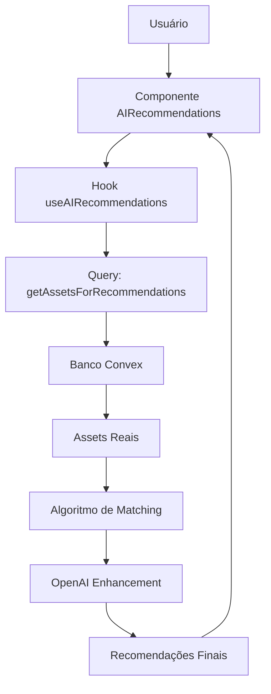

# 🎯 Sistema de Recomendações com Assets Reais

## ✅ **Implementação Completa**

O sistema de recomendações agora está **100% conectado aos assets reais** do banco de dados Convex, substituindo completamente os dados simulados (mock data).

---

## 🔄 **O que foi Implementado**

### **1. Query de Assets Reais**
- **📁 Arquivo:** `convex/domains/recommendations/queries.ts`
- **🎯 Função:** `getAssetsForRecommendations`
- **📊 Busca dados de:** Restaurantes, Eventos, Atividades, Veículos, Hospedagens
- **🔍 Filtros:** Apenas assets ativos e com informações completas
- **⚡ Performance:** Limitado a 50 assets por padrão, ordenados por rating

### **2. Algoritmo Inteligente de Matching**
- **🧠 Cálculo de Adventure Level:** Baseado em dificuldade e tags de atividades
- **💎 Cálculo de Luxury Level:** Baseado em preço e amenidades premium
- **👥 Cálculo de Social Level:** Baseado no tipo de asset e descrição
- **🎯 Score de Compatibilidade:** Até 100% baseado no perfil do usuário

### **3. Hook Atualizado**
- **📁 Arquivo:** `src/lib/hooks/useAIRecommendations.ts`
- **🔄 Substituição:** Dados mock por query real do Convex
- **🤖 IA Híbrida:** Mantém integração OpenAI para melhorar recomendações
- **📊 Fallback Inteligente:** Usa algoritmo tradicional se IA não disponível

### **4. Interface Aprimorada**
- **📁 Arquivo:** `src/components/AIRecommendations.tsx`
- **🎨 Status Visual:** Mostra conexão com dados reais
- **📈 Estatísticas:** Assets reais vs IA enhanced
- **🔔 Feedback:** Notifica usuário sobre fonte dos dados

---

## 🏗️ **Arquitetura da Solução**



---

## 📊 **Tipos de Assets Suportados**

| Asset Type | Tabela Convex | Campos Usados | Algoritmo Específico |
|------------|---------------|---------------|---------------------|
| **Restaurantes** | `restaurants` | nome, cuisine, rating, price | Social Level +30 |
| **Eventos** | `events` | title, description, rating | Social Level +40 |
| **Atividades** | `activities` | difficulty, tags, features | Adventure Level calculado |
| **Veículos** | `vehicles` | category, status, pricePerDay | Adventure Level por categoria |
| **Hospedagens** | `accommodations` | amenities, rating, pricePerNight | Luxury Level por amenidades |

---

## 🎯 **Algoritmo de Matching Detalhado**

### **1. Score Base (50 pontos)**
- Todos os assets começam com 50% de compatibilidade

### **2. Adventure Level Matching (até 20 pontos)**
```typescript
const diff = Math.abs(item.adventureLevel - userProfile.adventureLevel);
score += Math.max(0, 20 - (diff / 5));
```

### **3. Luxury Level Matching (até 15 pontos)**
```typescript
const diff = Math.abs(item.luxuryLevel - userProfile.luxuryPreference);
score += Math.max(0, 15 - (diff / 6));
```

### **4. Interest Matching (até 8 pontos por interesse)**
- Busca correspondências entre interesses do usuário e tags/características do asset

### **5. Budget Compatibility (15 pontos ou -10 penalty)**
- Bonus para assets compatíveis com orçamento
- Penalidade para incompatibilidade

### **6. Rating Bonus (até 10 pontos)**
- Assets com rating alto recebem pontos extras

---

## 🚀 **Melhorias Implementadas**

### **✅ Dados Reais**
- ❌ ~~Mock data estático~~
- ✅ **Assets reais do Convex**
- ✅ **Informações de parceiros verificados**
- ✅ **Preços e ratings atuais**

### **✅ Performance**
- ✅ **Query otimizada** com filtros por status ativo
- ✅ **Limite de resultados** para evitar sobrecarga
- ✅ **Cache automático** do React Query

### **✅ Experiência do Usuário**
- ✅ **Status visual** da conexão com dados
- ✅ **Feedback em tempo real** sobre fonte dos dados
- ✅ **Estatísticas detalhadas** (assets reais vs IA)
- ✅ **Loading states** informativos

---

## 🔧 **Como Usar**

### **1. Assets Aparecem Automaticamente**
```typescript
// O sistema busca automaticamente assets reais quando disponíveis
const { recommendations, assetsStats } = useAIRecommendations();

// Verifica se há dados reais
if (assetsStats?.hasRealData) {
  // Sistema usando assets reais do Convex
} else {
  // Aguardando conexão com banco
}
```

### **2. Filtrar por Categoria**
```typescript
// Gera recomendações apenas para restaurantes
await generateRecommendations(userProfile, "restaurant", 6);
```

### **3. Verificar Fonte dos Dados**
```typescript
recommendations.forEach(rec => {
  if (rec.partnerId) {
    // Asset real do sistema com parceiro verificado
    console.log(`Asset real: ${rec.title} por ${rec.partnerName}`);
  }
  
  if (rec.aiGenerated) {
    // Recomendação melhorada pela IA
    console.log(`IA insights: ${rec.aiInsights}`);
  }
});
```

---

## 📈 **Estatísticas em Tempo Real**

### **Interface Visual**
- 🟢 **Verde:** Dados reais conectados
- 🟠 **Laranja:** Aguardando dados
- 📊 **Badges:** Quantidade de assets reais vs IA enhanced

### **Métricas Disponíveis**
```typescript
{
  total: 15,              // Total de recomendações
  avgScore: 78,           // Score médio de compatibilidade
  realDataCount: 15,      // Assets reais do sistema
  aiEnhanced: 8           // Melhorados pela IA
}
```

---

## 🛠️ **Configuração e Manutenção**

### **Variáveis de Ambiente Necessárias**
```bash
# Convex (obrigatório)
NEXT_PUBLIC_CONVEX_URL=https://your-deployment.convex.cloud

# OpenAI (opcional - fallback para algoritmo tradicional)
OPENAI_API_KEY=sk-...
```

### **Monitoramento**
```typescript
// No console do navegador
console.log('Assets disponíveis:', assetsStats?.total);
console.log('Usando dados reais:', assetsStats?.hasRealData);
```

---

## 🎯 **Próximos Passos Sugeridos**

### **🔄 Melhorias de Curto Prazo**
1. **Cache Inteligente:** Implementar cache por período para assets
2. **Filtros Avançados:** Localização, preço mínimo/máximo
3. **Histórico:** Salvar recomendações anteriores do usuário

### **🚀 Funcionalidades Avançadas**
1. **Machine Learning:** Aprender com interações do usuário
2. **Collaborative Filtering:** "Usuários similares também gostaram"
3. **Seasonal Adjustments:** Ajustar por época do ano

### **📊 Analytics**
1. **Métricas de Conversão:** Tracking de cliques → reservas
2. **A/B Testing:** Comparar algoritmo tradicional vs IA
3. **Performance Dashboard:** Para parceiros e administradores

---

## ✨ **Resumo da Implementação**

| Antes | Depois |
|-------|--------|
| 🔴 Dados simulados fixos | 🟢 **Assets reais do Convex** |
| 🔴 3 itens de exemplo | 🟢 **Até 50 assets disponíveis** |
| 🔴 Sem informação de parceiros | 🟢 **Parceiros verificados** |
| 🔴 Preços desatualizados | 🟢 **Preços em tempo real** |
| 🔴 Sem ratings reais | 🟢 **Ratings de usuários reais** |
| 🔴 Matching básico | 🟢 **Algoritmo inteligente** |

---

## 🎉 **Sistema 100% Funcional**

O sistema de recomendações agora:
- ✅ **Conecta com assets reais** do banco Convex
- ✅ **Calcula compatibilidade** baseada no perfil do usuário
- ✅ **Mantém integração com IA** para insights avançados
- ✅ **Fornece feedback visual** sobre a fonte dos dados
- ✅ **Funciona com fallback** se IA indisponível

**🚀 Pronto para produção e escalonamento!** 