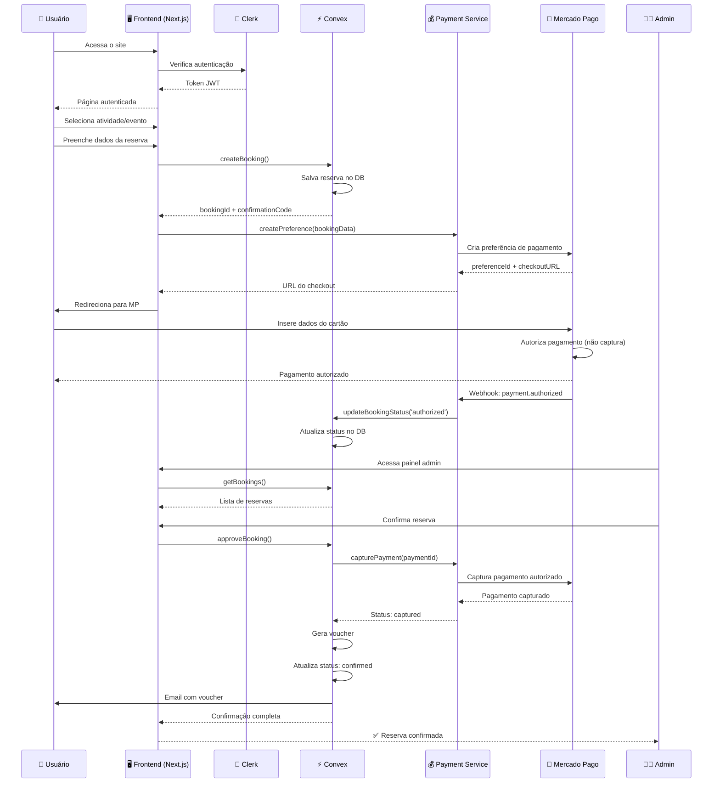
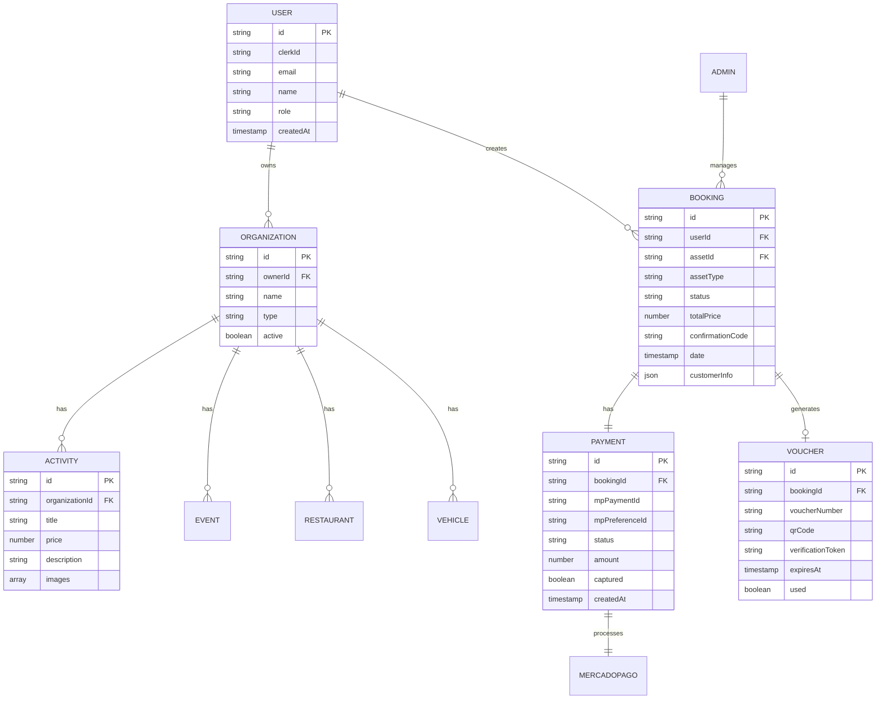
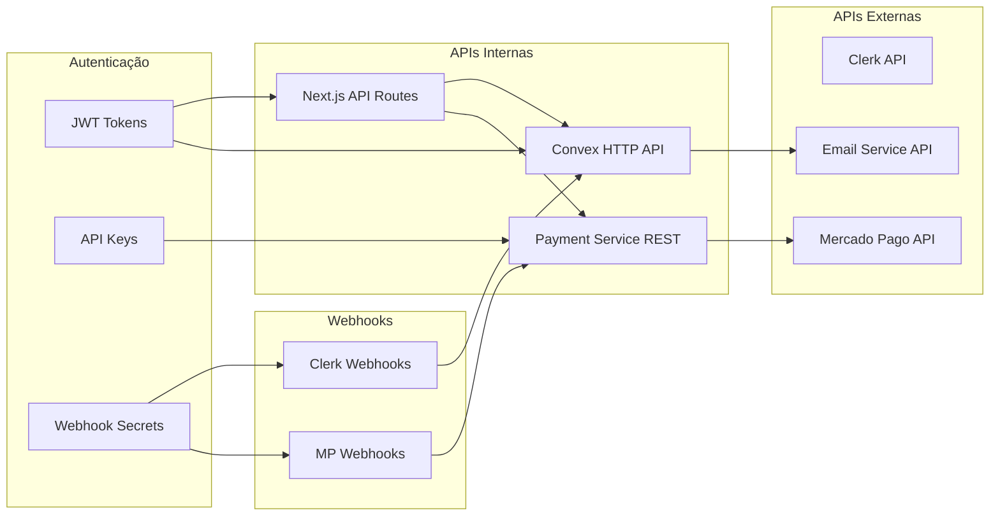
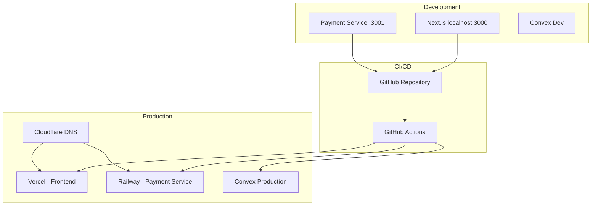
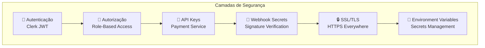
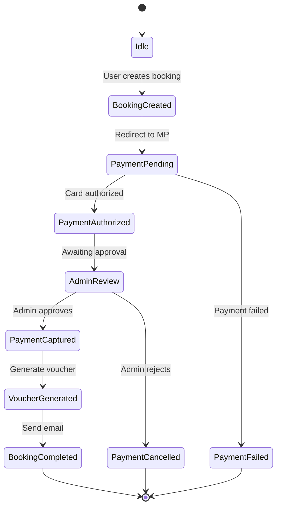

# 🏗️ Arquitetura Completa do Sistema - Tuca Noronha

## 📊 Diagrama de Arquitetura

```mermaid
graph TB
    %% Definindo estilos
    classDef frontend fill:#e1f5fe,stroke:#01579b,stroke-width:2px
    classDef backend fill:#f3e5f5,stroke:#4a148c,stroke-width:2px
    classDef auth fill:#fff3e0,stroke:#e65100,stroke-width:2px
    classDef payment fill:#e8f5e9,stroke:#1b5e20,stroke-width:2px
    classDef database fill:#fce4ec,stroke:#880e4f,stroke-width:2px
    classDef external fill:#f5f5f5,stroke:#424242,stroke-width:2px

    %% Frontend Layer
    subgraph "Frontend (Next.js)"
        UI[🖥️ Interface do Usuário]
        Pages[📄 Páginas]
        Hooks[🔗 React Hooks]
        PaymentSDK[💳 Payment Client SDK]
    end

    %% Authentication Layer
    subgraph "Autenticação (Clerk)"
        ClerkAuth[🔐 Clerk Auth]
        ClerkWebhook[🔔 Clerk Webhooks]
        UserMgmt[👥 Gestão de Usuários]
    end

    %% Backend Layer
    subgraph "Backend (Convex)"
        ConvexAPI[⚡ Convex API]
        Actions[🎯 Actions]
        Mutations[✏️ Mutations]
        Queries[🔍 Queries]
        ConvexDB[(🗄️ Database)]
    end

    %% Payment Service Layer
    subgraph "Payment Service (Express)"
        PaymentAPI[💰 Payment API]
        MPService[🏦 MercadoPago Service]
        WebhookHandler[🔔 Webhook Handler]
        Logger[📝 Logger]
    end

    %% External Services
    subgraph "Serviços Externos"
        MercadoPago[🏪 Mercado Pago API]
        EmailService[📧 Email Service]
        Storage[☁️ Storage (Convex)]
    end

    %% Conexões principais
    UI --> Pages
    Pages --> Hooks
    Hooks --> ConvexAPI
    Hooks --> PaymentSDK
    PaymentSDK --> PaymentAPI

    %% Fluxo de autenticação
    UI --> ClerkAuth
    ClerkAuth --> UserMgmt
    ClerkAuth --> ConvexAPI
    ClerkWebhook --> ConvexAPI

    %% Fluxo de dados Convex
    ConvexAPI --> Actions
    ConvexAPI --> Mutations
    ConvexAPI --> Queries
    Actions --> ConvexDB
    Mutations --> ConvexDB
    Queries --> ConvexDB

    %% Fluxo de pagamento
    PaymentAPI --> MPService
    MPService --> MercadoPago
    MercadoPago --> WebhookHandler
    WebhookHandler --> ConvexAPI
    WebhookHandler --> Logger

    %% Outros serviços
    ConvexAPI --> EmailService
    ConvexAPI --> Storage
    Actions --> PaymentAPI

    %% Aplicando estilos
    class UI,Pages,Hooks,PaymentSDK frontend
    class ClerkAuth,ClerkWebhook,UserMgmt auth
    class ConvexAPI,Actions,Mutations,Queries,ConvexDB backend
    class PaymentAPI,MPService,WebhookHandler,Logger payment
    class MercadoPago,EmailService,Storage external
```

## 🔄 Fluxo de Reserva e Pagamento Detalhado



## 🗂️ Estrutura de Dados



## 🔌 Integrações e APIs



## 🚀 Fluxo de Deploy



## 📋 Componentes e Responsabilidades

### **Frontend (Next.js)**
- Interface do usuário
- Renderização SSR/SSG
- Roteamento
- Estado local
- Cache de dados

### **Clerk (Autenticação)**
- Login/Cadastro
- Gestão de sessões
- JWT tokens
- Webhooks de usuários
- Proteção de rotas

### **Convex (Backend)**
- Database realtime
- Business logic
- File storage
- Background jobs
- Email triggers

### **Payment Service (Express)**
- Integração Mercado Pago
- Processamento de pagamentos
- Captura manual
- Webhooks de pagamento
- Logs de transações

### **Mercado Pago**
- Checkout Pro
- Autorização de cartões
- Captura de pagamentos
- Estornos/Cancelamentos
- Notificações IPN/Webhooks

## 🔐 Segurança



## 📊 Métricas e Monitoramento

- **Sentry**: Error tracking
- **Vercel Analytics**: Frontend metrics
- **Railway Metrics**: Payment Service health
- **Convex Dashboard**: Database monitoring
- **Mercado Pago Dashboard**: Payment analytics

## 🔄 Estados do Sistema



---

**Sistema Integrado v1.0** - Arquitetura completa com Payment Service
