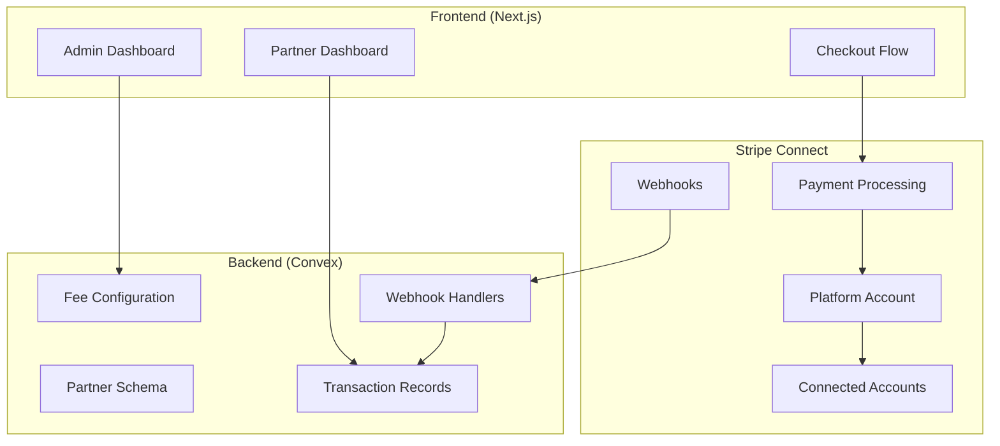
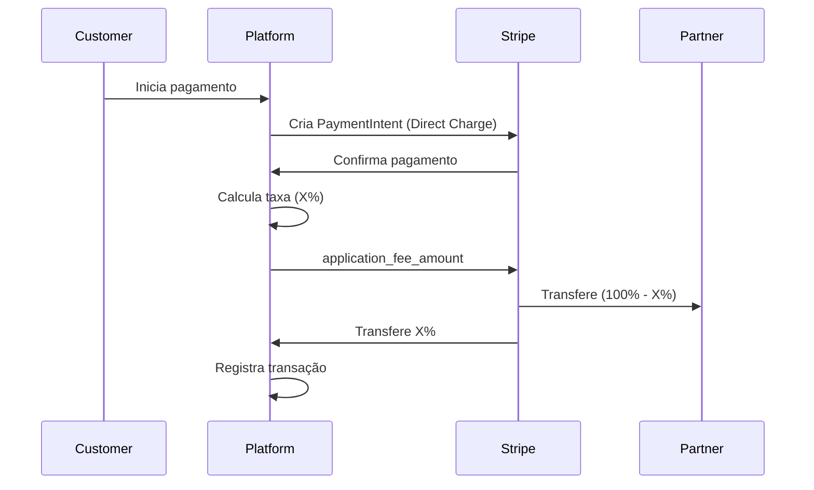

# Product Requirement Document: Sistema de Taxas para Partners com Stripe Connect

## Resumo Executivo

### O que estamos construindo?
Um sistema automatizado de gerenciamento de taxas e distribuição de pagamentos para parceiros da plataforma Travel Noronha Next, utilizando o Stripe Connect para processar pagamentos e dividir valores automaticamente entre a plataforma e os prestadores de serviços.

### Por que é importante?
- **Eliminação de processos manuais**: Hoje os repasses são feitos manualmente
- **Controle granular**: Permite definir taxas individuais por parceiro
- **Transparência**: Parceiros terão visibilidade total de suas transações
- **Escalabilidade**: Sistema automático que cresce com a plataforma

### Solução técnica
- **Stripe Connect** com Direct Charges e Application Fees
- **Convex** para gerenciamento de dados em tempo real
- **Next.js** para interfaces administrativas e de parceiros
- **Webhooks** para sincronização automática de dados

### Timeline estimado
- **6 semanas** para MVP completo
- **Fase 1-3**: Infraestrutura e sistema de taxas (3 semanas)
- **Fase 4-5**: Pagamentos e dashboards (3 semanas)

### Status de Implementação
- **Fase 1**: ✅ **CONCLUÍDA** - Infraestrutura base implementada
- **Fase 2**: ✅ **CONCLUÍDA** - Onboarding de partners funcionando
- **Fase 3**: ✅ **CONCLUÍDA** - Interface admin para taxas
- **Fase 4**: ⏳ **PENDENTE** - Processamento de pagamentos
- **Fase 5**: ⏳ **PENDENTE** - Dashboards e relatórios

### Fluxo Principal Simplificado

```
┌─────────────┐     ┌─────────────┐     ┌─────────────┐
│   Cliente   │     │  Plataforma │     │   Partner   │
└──────┬──────┘     └──────┬──────┘     └──────┬──────┘
       │                   │                     │
       │ Paga R$ 100       │                     │
       ├──────────────────►│                     │
       │                   │                     │
       │                   ├─ Taxa: 15%          │
       │                   │  (R$ 15)            │
       │                   │                     │
       │                   ├─ Partner: 85%       │
       │                   │  (R$ 85 - fees)    ├─────────►
       │                   │                     │
       │                   │                     │
```

---

## 1. Visão Geral do Produto

### 1.1 Contexto
O Travel Noronha Next (TN-Next) é uma plataforma de marketplace que conecta viajantes com prestadores de serviços turísticos em Fernando de Noronha. Atualmente, a plataforma processa pagamentos através do Stripe, mas não possui um sistema robusto para gerenciar taxas individuais por parceiro e distribuir automaticamente os valores após as transações.

### 1.2 Problema
- **Falta de controle granular**: Não existe um sistema para definir taxas individuais por parceiro
- **Processo manual**: A distribuição de valores aos parceiros é feita manualmente
- **Falta de transparência**: Parceiros não têm visibilidade clara sobre suas transações e valores a receber
- **Escalabilidade limitada**: O processo atual não escala com o crescimento da plataforma

### 1.3 Solução Proposta
Implementar um sistema completo de gerenciamento de taxas e distribuição automática de pagamentos utilizando o Stripe Connect, permitindo que:
- O administrador master configure taxas individuais para cada parceiro
- Os pagamentos sejam automaticamente divididos entre a plataforma e os parceiros
- Os parceiros tenham visibilidade completa de suas transações
- O sistema seja totalmente automatizado e escalável

## 2. Objetivos e Escopo

### 2.1 Objetivos Principais
1. **Automatização completa** do processo de split de pagamentos
2. **Flexibilidade** para definir taxas individuais por parceiro
3. **Transparência** total nas transações para todos os envolvidos
4. **Conformidade** com regulamentações financeiras e fiscais
5. **Escalabilidade** para suportar crescimento da plataforma

### 2.2 Escopo do MVP
- ✅ Criação e onboarding de contas conectadas no Stripe
- ✅ Interface para configuração de taxas por parceiro
- ✅ Split automático de pagamentos usando Direct Charges
- ✅ Dashboard para parceiros visualizarem suas transações
- ✅ Webhooks para sincronização de dados
- ✅ Relatórios básicos de transações

### 2.3 Fora do Escopo (Fase 2)
- ❌ Sistema de faturas customizadas
- ❌ Múltiplas moedas
- ❌ Pagamentos programados/recorrentes
- ❌ Sistema de disputas avançado

## 3. Requisitos Funcionais

### 3.1 Gerenciamento de Taxas (Admin)

#### RF01: Configuração de Taxa Individual
- **Como** administrador master
- **Quero** definir uma taxa percentual individual para cada parceiro
- **Para** ter controle granular sobre a monetização da plataforma

**Critérios de Aceitação:**
- [ ] Interface para listar todos os parceiros
- [x] Campo para definir taxa percentual (0-100%)
- [x] Validação de valores (mínimo 0%, máximo permitido configurável)
- [x] Histórico de alterações de taxa
- [x] Taxa padrão para novos parceiros

#### RF02: Visualização de Configurações
- **Como** administrador
- **Quero** visualizar todas as taxas configuradas
- **Para** ter uma visão geral das configurações da plataforma

### 3.2 Onboarding de Parceiros

#### RF03: Criação de Conta Conectada
- **Como** parceiro
- **Quero** conectar minha conta ao sistema
- **Para** receber pagamentos automaticamente

**Critérios de Aceitação:**
- [x] Fluxo de onboarding simplificado
- [x] Coleta de informações necessárias (KYC/AML)
- [x] Verificação de documentos
- [x] Status de aprovação visível

### 3.3 Processamento de Pagamentos

#### RF04: Split Automático de Pagamentos
- **Como** sistema
- **Quero** dividir automaticamente cada pagamento
- **Para** distribuir valores conforme taxas configuradas

**Critérios de Aceitação:**
- [ ] Cálculo automático da taxa da plataforma
- [ ] Transferência imediata para conta do parceiro
- [ ] Registro completo da transação
- [ ] Tratamento de erros e reversões

### 3.4 Visualização e Relatórios

#### RF05: Dashboard do Parceiro
- **Como** parceiro
- **Quero** visualizar minhas transações e saldos
- **Para** acompanhar meus ganhos na plataforma

**Critérios de Aceitação:**
- [ ] Lista de transações com filtros
- [ ] Saldo disponível e pendente
- [ ] Histórico de pagamentos recebidos
- [ ] Exportação de dados (CSV/PDF)

## 4. Arquitetura Técnica

### 4.1 Stack Tecnológica
- **Frontend**: Next.js 15+ (App Router), TypeScript, Tailwind CSS, Shadcn/ui
- **Backend**: Convex (real-time database)
- **Pagamentos**: Stripe Connect API
- **Autenticação**: Clerk
- **Monitoramento**: Sentry

### 4.2 Arquitetura de Alto Nível



### 4.3 Modelo de Dados (Convex)

```typescript
// Schema: partners
{
  _id: Id<"partners">,
  userId: Id<"users">,
  stripeAccountId: string,
  onboardingStatus: "pending" | "in_progress" | "completed" | "rejected",
  feePercentage: number, // 0-100
  isActive: boolean,
  capabilities: {
    cardPayments: boolean,
    transfers: boolean,
  },
  metadata: {
    businessName?: string,
    businessType?: string,
    country: string,
  },
  createdAt: number,
  updatedAt: number,
}

// Schema: partnerFees
{
  _id: Id<"partnerFees">,
  partnerId: Id<"partners">,
  feePercentage: number,
  effectiveDate: number,
  createdBy: Id<"users">,
  reason?: string,
  previousFee?: number,
}

// Schema: partnerTransactions
{
  _id: Id<"partnerTransactions">,
  partnerId: Id<"partners">,
  bookingId: Id<"bookings">,
  stripePaymentIntentId: string,
  stripeTransferId?: string,
  amount: number, // em centavos
  platformFee: number, // em centavos
  partnerAmount: number, // em centavos
  currency: string,
  status: "pending" | "completed" | "failed" | "refunded",
  metadata: any,
  createdAt: number,
}
```

## 5. Implementação Backend (Convex)

### 5.1 Estrutura de Arquivos

```
convex/
├── domains/
│   ├── partners/    ✅ IMPLEMENTADO
│   │   ├── index.ts
│   │   ├── mutations.ts
│   │   ├── queries.ts
│   │   ├── actions.ts
│   │   ├── types.ts
│   │   └── utils.ts
│   ├── stripe/      ✅ ATUALIZADO
│   │   ├── connect.ts (integrado)
│   │   ├── webhooks.ts (atualizado)
│   │   └── utils.ts (existente)
```

### 5.2 APIs Principais

#### Mutations ✅ IMPLEMENTADAS
- `createPartner`: Cria registro de parceiro
- `updateOnboardingStatus`: Atualiza status de onboarding
- `updatePartnerFee`: Atualiza taxa do parceiro
- `updatePartnerCapabilities`: Atualiza capacidades
- `updatePartnerMetadata`: Atualiza metadados

#### Queries ✅ IMPLEMENTADAS
- `getPartnerByUserId`: Busca parceiro por userId
- `getPartnerByStripeAccountId`: Busca por Stripe ID
- `listPartners`: Lista todos os parceiros
- `getPartnerTransactions`: Lista transações do parceiro
- `getPartnerTransactionsByBooking`: Busca por booking
- `getPartnerAnalytics`: Analytics do parceiro

#### Actions ✅ IMPLEMENTADAS
- `createStripeConnectedAccount`: Cria conta no Stripe
- `generateOnboardingLink`: Gera link de onboarding
- `refreshAccountStatus`: Atualiza status da conta
- `getStripeLoginLink`: Gera link para Express Dashboard
- `calculatePartnerPayout`: Calcula valores de repasse

### 5.3 Webhook Handlers ✅ IMPLEMENTADOS

```typescript
// Eventos críticos do Stripe Connect implementados
- account.updated ✅
- account.application.authorized ✅
- account.external_account.created ✅
- account.external_account.updated ✅
- capability.updated ✅
- payment_intent.succeeded ⏳ (parcialmente)
- transfer.created ⏳
- transfer.failed ⏳
- payout.paid ⏳
- payout.failed ⏳
```

## 6. Implementação Frontend

### 6.1 Páginas e Componentes

#### Admin Dashboard
```
/admin/dashboard/configuracoes/taxas ✅ IMPLEMENTADO
├── page.tsx ✅
├── components/
│   ├── TaxasPartnersList.tsx ✅
│   ├── TaxaPartnerModal.tsx ✅
│   ├── TaxaHistoryDrawer.tsx ✅
│   └── TaxaBulkActions.tsx ✅
```

#### Partner Dashboard
```
/meu-painel/configuracoes ✅ IMPLEMENTADO
├── page.tsx (com abas)
├── onboarding/page.tsx (callback)

/meu-painel/financeiro ⏳ PENDENTE
├── TransactionsList.tsx
├── BalanceCard.tsx
├── PayoutHistory.tsx
└── FinancialReports.tsx
```

#### Componentes Implementados ✅
```
/components/partners/
├── PartnerOnboarding.tsx ✅
├── OnboardingStatus.tsx ✅

/lib/hooks/
├── usePartner.ts ✅
```

### 6.2 Fluxos de UI

#### Fluxo de Configuração de Taxa ⏳ PENDENTE
1. Admin acessa página de configurações
2. Visualiza lista de parceiros com taxas atuais
3. Clica em "Editar Taxa"
4. Modal com validações e confirmação
5. Salva e cria registro no histórico

#### Fluxo de Onboarding do Parceiro ✅ IMPLEMENTADO
1. Parceiro acessa área de configurações ✅
2. Clica em "Conectar Conta Bancária" ✅
3. Redirecionado para Stripe Connect ✅
4. Completa informações necessárias ✅
5. Retorna ao sistema com status atualizado ✅

## 7. Integrações com Stripe Connect

### 7.1 Configuração da Plataforma

```typescript
// Tipo de integração: Direct Charges com Application Fee
{
  controller: {
    fees: { payer: "application" }, // Plataforma paga fees do Stripe
    losses: { payments: "application" }, // Plataforma assume riscos
    stripe_dashboard: { type: "express" }, // Partners têm Express Dashboard
    requirement_collection: "stripe" // Stripe coleta requisitos
  },
  capabilities: {
    card_payments: { requested: true },
    transfers: { requested: true }
  }
}
```

### 7.2 Fluxo de Pagamento



### 7.3 Cálculo de Valores

```typescript
// Exemplo de cálculo
const totalAmount = 10000; // R$ 100,00 em centavos
const partnerFeePercentage = 15; // 15% para a plataforma
const stripeFee = 290 + Math.floor(totalAmount * 0.029); // 2.9% + 29¢

const platformFee = Math.floor(totalAmount * (partnerFeePercentage / 100));
const partnerAmount = totalAmount - platformFee - stripeFee;

// Resultado:
// Total: R$ 100,00
// Stripe Fee: R$ 3,19
// Platform Fee: R$ 15,00
// Partner recebe: R$ 81,81
```

## 8. Fluxo de Implementação

### 8.1 Fase 1: Infraestrutura Base ✅ CONCLUÍDA
- [x] Configurar Stripe Connect na conta
- [x] Criar schemas no Convex
- [x] Implementar autenticação de webhooks
- [x] Criar estrutura base de arquivos

### 8.2 Fase 2: Onboarding de Partners ✅ CONCLUÍDA
- [x] Implementar criação de contas conectadas
- [x] Criar fluxo de onboarding
- [x] Implementar verificação de status
- [x] Testes com contas de teste

### 8.3 Fase 3: Sistema de Taxas ✅ CONCLUÍDA
- [x] Interface admin para configurar taxas
- [x] Histórico de alterações
- [x] Validações e regras de negócio
- [x] Testes de cálculo

### 8.4 Fase 4: Processamento de Pagamentos ⏳ PENDENTE
- [ ] Modificar checkout para Direct Charges
- [ ] Implementar cálculo de application_fee
- [ ] Webhook handlers para eventos
- [ ] Tratamento de erros e reversões

### 8.5 Fase 5: Dashboards e Relatórios ⏳ PENDENTE
- [ ] Dashboard do parceiro
- [ ] Relatórios financeiros
- [ ] Exportação de dados
- [ ] Testes de integração

## 9. Testes e Validação

### 9.1 Testes Unitários
- Cálculo de taxas e valores
- Validações de dados
- Transformações de moeda

### 9.2 Testes de Integração
- Fluxo completo de pagamento
- Webhooks do Stripe
- Sincronização de dados

### 9.3 Testes E2E
- Onboarding de parceiro
- Configuração de taxa
- Processamento de pagamento
- Visualização de relatórios

### 9.4 Cenários de Teste

```typescript
// Casos de teste críticos
1. Pagamento com sucesso e split correto
2. Falha no pagamento antes do split
3. Falha na transferência após pagamento
4. Reembolso total e parcial
5. Alteração de taxa durante período
6. Conta conectada desativada
7. Limites de transferência excedidos
```

## 10. Considerações de Segurança

### 10.1 Autenticação e Autorização
- Apenas admin master pode configurar taxas
- Partners só visualizam suas próprias transações
- Validação de permissões em todas as APIs

### 10.2 Proteção de Dados
- Criptografia de dados sensíveis
- Não armazenar dados de cartão
- Logs de auditoria para alterações críticas

### 10.3 Conformidade
- PCI DSS compliance via Stripe
- LGPD para dados de parceiros
- Documentação de termos de uso

## 11. Métricas de Sucesso

### 11.1 KPIs Técnicos
- Taxa de sucesso de pagamentos > 95%
- Tempo de processamento < 3 segundos
- Disponibilidade do sistema > 99.9%

### 11.2 KPIs de Negócio
- Redução de 100% no trabalho manual
- Aumento na satisfação dos parceiros
- Redução em disputas financeiras

## 12. Riscos e Mitigações

### 12.1 Riscos Técnicos
| Risco | Impacto | Probabilidade | Mitigação |
|-------|---------|---------------|-----------|
| Falha na API do Stripe | Alto | Baixa | Implementar retry e fallback |
| Cálculo incorreto de taxas | Alto | Média | Testes extensivos e logs |
| Perda de dados de transação | Alto | Baixa | Backup e idempotência |

### 12.2 Riscos de Negócio
| Risco | Impacto | Probabilidade | Mitigação |
|-------|---------|---------------|-----------|
| Resistência dos parceiros | Médio | Média | Comunicação e treinamento |
| Questões regulatórias | Alto | Baixa | Consultoria jurídica |

## 13. Próximos Passos

### Imediato
1. Aprovação deste PRD
2. Setup da conta Stripe Connect
3. Criação de ambiente de testes

### Curto Prazo (Sprint 1-2)
1. Implementação da infraestrutura base
2. Onboarding de parceiros piloto
3. Testes iniciais de integração

### Médio Prazo (Sprint 3-4)
1. Lançamento beta com parceiros selecionados
2. Coleta de feedback
3. Ajustes e melhorias

### Longo Prazo
1. Lançamento completo
2. Features avançadas (Fase 2)
3. Expansão internacional

## 14. Apêndices

### A. Referências Técnicas
Use Connect to build a platform, marketplace, or other business that manages payments and moves money between multiple parties.

- [Stripe Connect Documentation](https://stripe.com/docs/connect)
- [Direct Charges Guide](https://stripe.com/docs/connect/direct-charges)
- [Connect Webhooks](https://stripe.com/docs/connect/webhooks)
- [Convex Documentation](https://docs.convex.dev)
- [1099-NEC form state requirements](https://docs.stripe.com/connect/1099-NEC.md): View the state requirements for 1099-NEC forms.
- [Create a charge](https://docs.stripe.com/connect/charges.md): Create a charge and split payments between your platform and your sellers or service providers.
- [Required verification information](https://docs.stripe.com/connect/required-verification-information.md): Learn what required verification information you need to collect for each country when using Connect.
- [Connect account types](https://docs.stripe.com/connect/accounts.md): Learn about older connected account configurations.
- [US tax reporting for Connect platforms](https://docs.stripe.com/connect/tax-reporting.md): Learn how to report the annual payments for your US-based connected accounts.
- [How Connect works](https://docs.stripe.com/connect/how-connect-works.md): Learn how Connect's features support multiparty integrations.
- [Payouts to connected accounts](https://docs.stripe.com/connect/payouts-connected-accounts.md): Manage payouts and external accounts for your platform's connected accounts.
- [1099-K form state requirements](https://docs.stripe.com/connect/1099-K.md): View the state requirements for 1099-K forms.
- [Making API calls for connected accounts](https://docs.stripe.com/connect/authentication.md): Learn how to add the right information to your API calls so you can make calls for your connected accounts.
- [Using Connect with Standard connected accounts](https://docs.stripe.com/connect/standard-accounts.md): Use Standard connected accounts to get started using Connect right away, and let Stripe handle the majority of the connected account experience.
- [Choose your onboarding configuration](https://docs.stripe.com/connect/onboarding.md): Learn about the different options for onboarding your connected accounts.
- [Using Connect with Custom connected accounts](https://docs.stripe.com/connect/custom-accounts.md): Use Custom connected accounts with Connect to control your connected accounts' entire experience.
- [Express Dashboard](https://docs.stripe.com/connect/express-dashboard.md): Learn about the features of the Express Dashboard.
- [Stripe-hosted onboarding](https://docs.stripe.com/connect/hosted-onboarding.md): Onboard connected accounts by redirecting them to a Stripe-hosted onboarding flow.
- [Payment details](https://docs.stripe.com/connect/supported-embedded-components/payment-details.md): Show details of a given payment and allow users to manage disputes and perform refunds.
- [Identity verification for connected accounts](https://docs.stripe.com/connect/identity-verification.md): Use identity verification to reduce risk on your platform when using Connect.
- [Using manual payouts](https://docs.stripe.com/connect/manual-payouts.md): Send manual payouts to your connected accounts.
- [Connect webhooks](https://docs.stripe.com/connect/webhooks.md): Learn how to use webhooks with Connect to be notified of Stripe activity.
- [Manage connected accounts with the Dashboard](https://docs.stripe.com/connect/dashboard.md): Learn about using the Stripe Dashboard to find and manage connected accounts, including those with open risk, onboarding, and compliance requirements.
- [Get started with tax reporting](https://docs.stripe.com/connect/get-started-tax-reporting.md): Use the Stripe 1099 tax reporting product to create, modify, file, and deliver tax forms for your connected accounts.
- [Platform pricing tools](https://docs.stripe.com/connect/platform-pricing-tools.md): Use your Dashboard editor to manage your application fee pricing logic.
- [Update and create 1099 tax forms](https://docs.stripe.com/connect/modify-tax-forms.md): Update and create 1099 tax forms for connected accounts.
- [Balance](https://docs.stripe.com/api/balance.md)
- [The Balance object](https://docs.stripe.com/api/balance/balance_object.md)

### B. Exemplos de Código
- Implementação de referência do Stripe
- Casos de uso similares
- Best practices de segurança

### C. Glossário
- **Direct Charge**: Cobrança feita diretamente na conta conectada
- **Application Fee**: Taxa cobrada pela plataforma
- **Connected Account**: Conta do parceiro no Stripe
- **Platform Account**: Conta principal da plataforma

---

**Documento criado em**: Janeiro 2025  
**Versão**: 1.1  
**Autor**: Equipe de Engenharia TN-Next  
**Status**: Em Implementação (Fases 1-2 Concluídas)

## 15. Histórico de Atualizações

### Versão 1.1 - Janeiro 2025
**Status**: Fases 1 e 2 Concluídas

#### Implementações Realizadas:
1. **Backend (Convex)**:
   - Domínio completo de `partners` com 5 mutations, 6 queries e 5 actions
   - Integração com webhooks do Stripe Connect
   - Sistema de tipos TypeScript completo
   - Utilitários para cálculo de taxas

2. **Frontend (Next.js)**:
   - Hook `usePartner` para gerenciamento de estado
   - Componente `PartnerOnboarding` com seleção PF/PJ
   - Componente `OnboardingStatus` com indicadores visuais
   - Página de configurações com abas
   - Integração com header (botão de configurações)

3. **Integrações**:
   - Stripe Connect API versão 2025-05-28.basil
   - Webhooks configurados e funcionando
   - Direct Charges com Application Fees preparado

#### Atualizações:
- **Fase 3 Concluída**: Interface administrativa para configuração de taxas
  - Página de taxas em `/admin/dashboard/configuracoes/taxas`
  - Lista de parceiros com busca e filtros
  - Modal para edição individual de taxas
  - Histórico de alterações com timeline visual
  - Ações em massa para múltiplos parceiros
  - Testes de cálculo implementados e validados

#### Próximas Etapas:
- Fase 4: Modificação do checkout para usar Direct Charges
- Fase 5: Dashboards financeiros completos

---

**Documento criado em**: Janeiro 2025  
**Versão**: 1.1  
**Autor**: Equipe de Engenharia TN-Next  
**Status**: Em Implementação (Fases 1-2 Concluídas) 